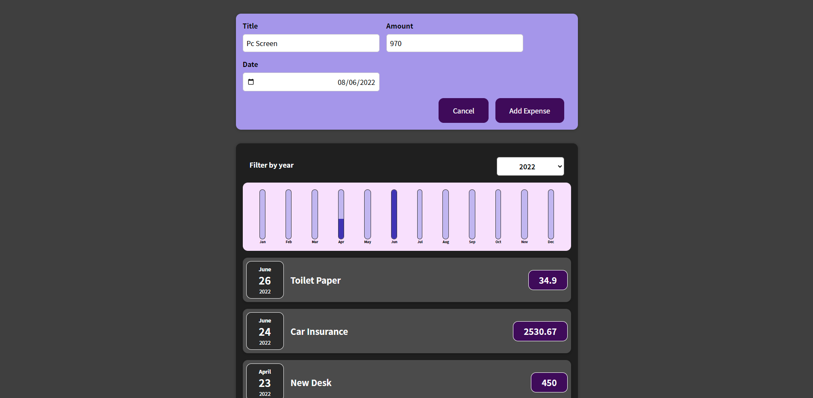
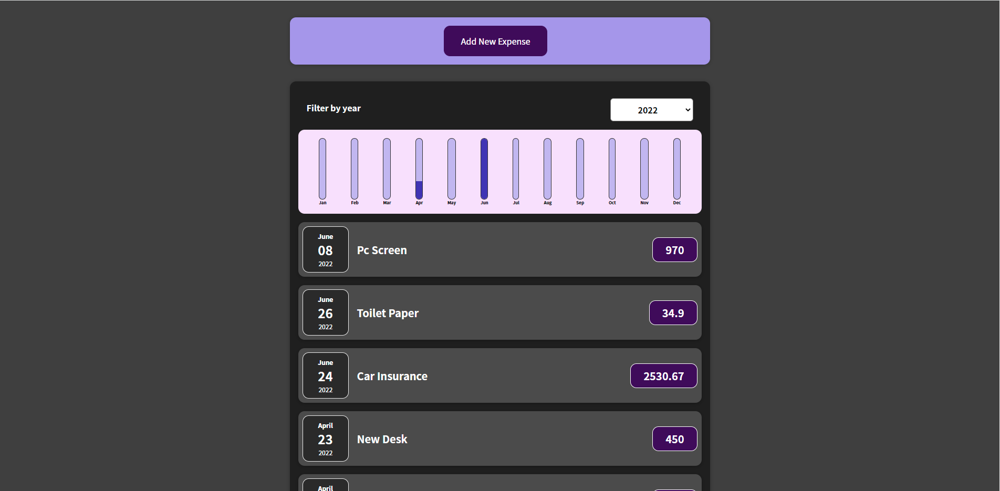

# Expenses

### **Design**

This app was built as part of the practice and implementation of React.

The development of the front has been completed:

- Design and main core

future plan

- Dynamic list of expenses
- Saving data in a database
- management on the server→ back

### **Technology used**

- This App was build in ReactJS, HTML, CSS
- The App is fully responsive.

### Expenses Form

### Expenses App

## Build process

Run on Localhost

`npm start`

This will start the server on port 3000 on your local machine
